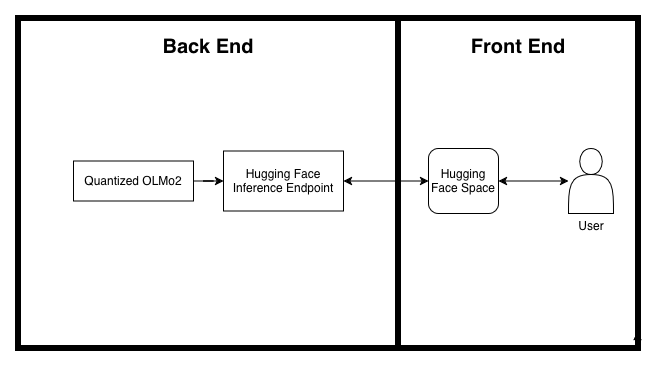
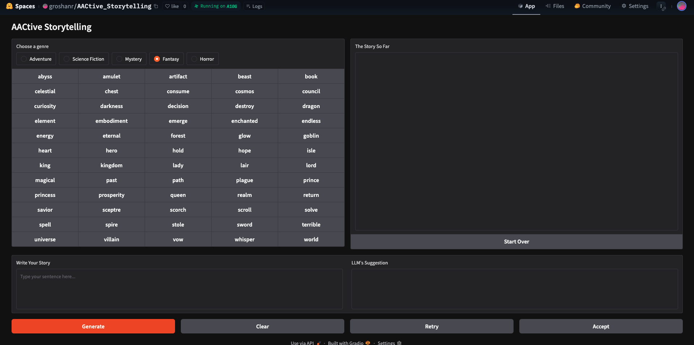

# AACtive Storytelling

## Project Description
**AACtive Storytelling** is an *augmentative and alternative communication* (AAC) app that integrates a quantized LLM,  topic modeling, and prompt engineering to create a collaborative story writing experience.

The back end of the system is composed of an OLMo2 model that was quantized to 4-bit using unsloth. It was then finetuned on the [Tiny Stories dataset](http://arxiv.org/abs/2305.07759). The model was uploaded in GGUF format to Hugging Face
([groshanr/olmo2_quantized_ft.gguf](https://huggingface.co/groshanr/olmo2_quantized_ft.gguf)). A Hugging Face Inference Endpoint was set up so the model would be accessible by a Hugging Face Space. 

The front end of the system is a Gradio-based Hugging Face Space (see demo below). I used FASTopic to perform topic modeling on five genres (mystery, fantasy, horror, adventure, and science fiction) from the [FareedKhan/1k_stories_100_genre dataset](https://huggingface.co/datasets/FareedKhan/1k_stories_100_genre). I selected 60 words from the top 10 topics for each of these genres. These words were used to create the dynamic AAC button boards. 

## System Diagram



## User Experience

1. Type on their device keyboard or press word buttons on screen to write a sentence. 
2. Click **Generate** for the LLM to output a suggested sentence.
3. The user can (1) click **Retry** to rerun the prompt, (2) type in either the *Write Your Story* or *LLM's Suggestion* boxes to update them, (3) or **Clear** the prompt entirely and start over. 
4. Once the user likes the sentence, they can click **Accept** which will add it to the *The Story So Far* section. The user can clear this box using **Start Over**.

## Usage
### Hugging Face Space Demo
Check out the demo [here](
https://huggingface.co/spaces/groshanr/AACtive_Storytelling). 

### Running locally
#### Prerequisites
- Your preferred method of locally running an LLM. I recommend [LM Studio](https://lmstudio.ai/).

#### Run LLM locally
1. Download ```olmo2_quantized_ft.gguf```.
1. Ensure that the GGUF file is in the Models Directory. You can find that location in the third tab with a folder icon in LM Studio.
2. Load the model in.
3. Serve the model on localhost. See [this documentation](https://lmstudio.ai/docs/developer/core/server) from LM Studio.
4. Note the local server address. You will need to change the ```base_url``` variable in line 10 of ```app.py``` to point towards it. For example:  ```http://127.0.0.1:1234/v1 ```. The ```v1``` is important for it to run.

#### Create environment 
``` 
conda create -n <env_name> python=3.11
conda activate <env_name>
pip install -r ./requirements.txt
```

#### Run the app
```
python app.py
```

